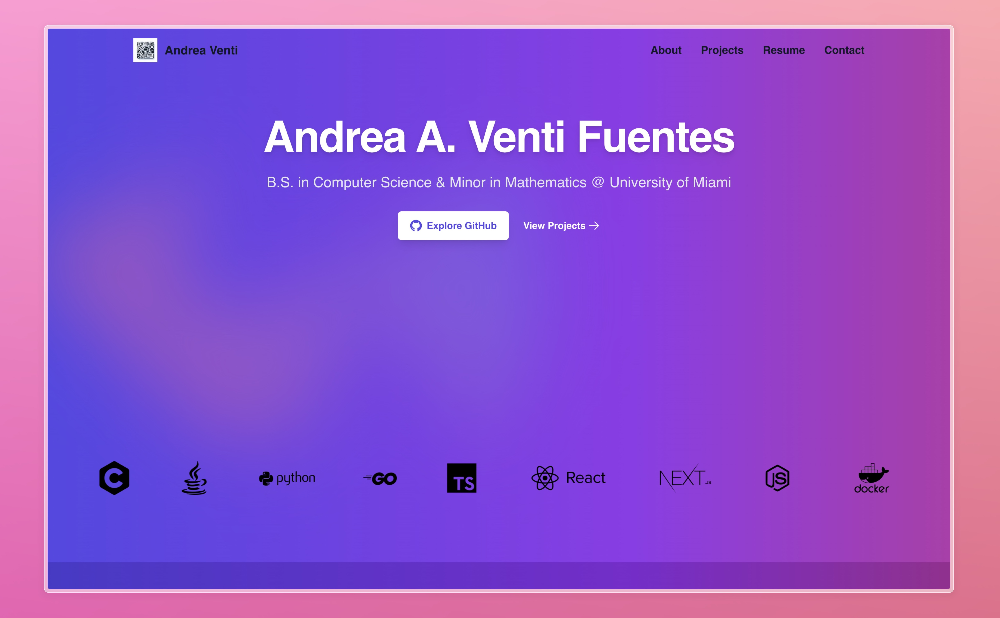

# Portfolio Website

<!--toc:start-->

-   [Portfolio Website](#portfolio-website)
    -   [Tech Stack](#tech-stack)
    -   [Preview](#preview)
    -   [Project Structure](#project-structure)
    -   [Key Features](#key-features)
    -   [Production Dependencies](#production-dependencies)
    -   [License](#license)
    <!--toc:end-->

This repository contains the source code for my personal portfolio website, hosted at [www.andreaventi.com](https://www.andreaventi.com). The site showcases my projects, skills, and experience as a software engineer.

## Tech Stack

-   **Framework:** Next.js
-   **Language:** TypeScript
-   **Styling:** Tailwind CSS
-   **Animation Library:** AOS (Animate on Scroll)
-   **Build Tools:** PostCSS, pnpm
-   **Deployment:** Vercel

## Preview

## Project Structure

-   **`/src/app`**: Contains the core pages of the website, including `about`, `projects`, `resume`, and `contact`.
-   **`/public`**: Holds static assets like images for projects and the website's favicon.
-   **`/components`**: Reusable components such as the header, footer, and AOS initializer.
-   **`/styles`**: Global styles applied to the site using Tailwind CSS.

## Key Features

-   **Responsive Design**: Built with mobile-first principles to ensure the site looks great on any device.
-   **Animations**: Dynamic animations powered by AOS (Animate on Scroll) for smooth user experience.
-   **Contact Form**: Integrated with Formspree for seamless message submissions.
-   **Project Showcases**: Displays key projects with descriptions, technologies used, and links to source code and live demos.

## Production Dependencies

-   **Formspree**: `@formspree/react` - For handling form submissions.
-   **FontAwesome**:
    -   `@fortawesome/fontawesome-svg-core`
    -   `@fortawesome/free-brands-svg-icons`
    -   `@fortawesome/free-solid-svg-icons`
    -   `@fortawesome/react-fontawesome`
        -   For icons used in the UI.
-   **Headless UI**: `@headlessui/react` - For accessible UI components.
-   **Heroicons**: `@heroicons/react` - For additional icons.
-   **Vercel Analytics**: `@vercel/analytics` - For tracking analytics on Vercel.
-   **Vercel Speed Insights**: `@vercel/speed-insights` - For performance insights.
-   **AOS**: `aos` - Animation on scroll.
-   **Plaiceholder**: `plaiceholder` - For handling image placeholders with blur effects.
-   **React**: `react` - For building the UI.
-   **React DOM**: `react-dom` - For rendering React components.
-   **React Swipeable**: `react-swipeable` - For handling swipe gestures in the carousel.
-   **Sharp**: `sharp` - For image processing.

## License

This project is licensed under a Proprietary License. See the [`LICENSE`](LICENSE) file for more details.

**Note:** _All project illustrations on this website were generated using OpenAI's DALL·E._
